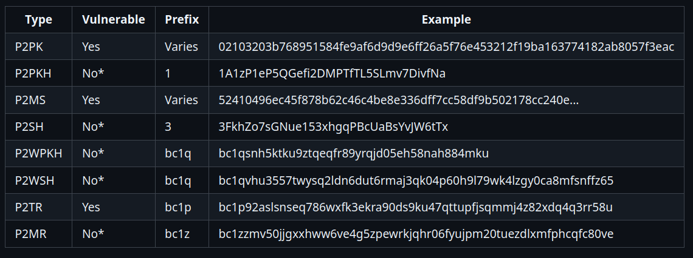
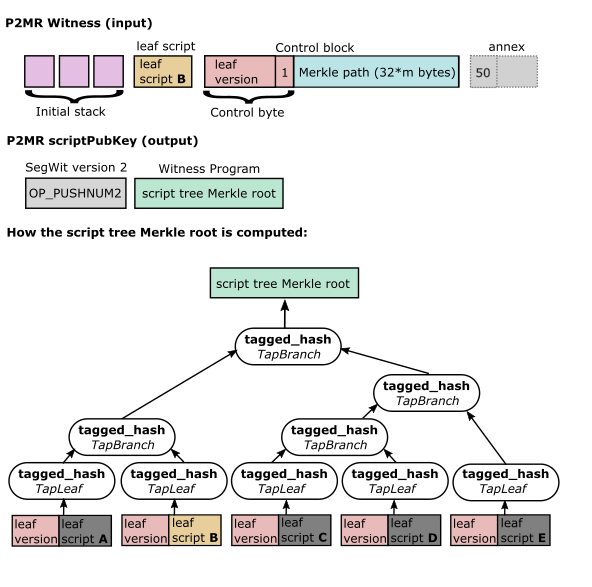

# Quantum Computing Threat to Bitcoin

## Presentation Length
* 30 minutes including quesitons

## Audience

* Bitcoin: beginner to advance on bitcoin  
* QC: no knowledge to intermediate

## Topic Intro
- Interesting and difficult topic to present on because it lies at the intersection of four disciplinary pillars
  1. the strange world of quantum mechanics,
  2. the intricate mathematics of cyrptography,
  3. the elegant structures of computer science, and
  4. the innovative functions of Bitcoin.
- I'm currently studying the first three: physics, math, and computer science; and have had a keen interest in the technical aspects of Bitcoin for many years.
- This topic has a lot of FUD around it and one of my aims is to reduce that:
  - Understanding a threat and what is being done can eleviate fear,
  - Uncertainty is a big thing in the QC space and won't be going away, so learn to live with
  - Doubt exists on both sides of people underselling and overselling the risk. I hope to clear up some of those doubts
- Explore further as not much time here.s

## Objective

* Overview the threat, what can we do, what can you do.

## Outline

* ### What is Quantum Computing (QC) — ALT

  * Three components: qubits, quantum gates, measurement
  * Physical qubits → error correction → logical qubits
  * Fault tolerance: the key engineering challenge
  * CRQC: a QC with enough logical qubits to break cryptography
  * Current uses: drug discovery, optimisation

  #### Notes
  * **Qubits**: the basic unit — like a bit but can be in superposition (both 0 and 1 simultaneously). Superposition is what gives QC its parallelism.
  * **Quantum gates**: operations that manipulate qubits, analogous to logic gates in classical computing. They exploit superposition and entanglement to perform computations across many states at once.
  * **Measurement**: collapses a qubit’s superposition into a definite 0 or 1. Quantum algorithms are designed so that measuring at the end gives the correct answer with high probability.
  * **Physical vs logical qubits**: physical qubits are the actual hardware (superconducting circuits, trapped ions, etc.) and are extremely error-prone. Multiple physical qubits are combined via quantum error correction codes to form one reliable logical qubit. Current ratios are roughly 1,000:1 or worse.
  * **Fault tolerance**: the ability to perform long computations despite individual qubit errors. Without fault tolerance a QC can only run very short, noisy circuits. Achieving fault tolerance at scale is the single biggest engineering barrier to a CRQC.
  * **CRQC (Cryptographically Relevant Quantum Computer)**: a fault-tolerant QC with enough logical qubits and sufficient runtime to execute Shor’s algorithm against real-world key sizes (e.g. ECDSA-256). Estimates range from ~2,000–4,000 logical qubits, which translates to millions of physical qubits with current error rates.
  * **Current commercial uses**: Pharmaceutical companies are paying for QC time to simulate molecular interactions for drug discovery. Logistics and finance firms use quantum annealers and hybrid algorithms for combinatorial optimisation problems (routing, portfolio optimisation). These are the applications attracting real revenue today, which signals where the technology is genuinely useful right now.

* ### What is Quantum Computing (QC) — ORIGINAL

  * What makes it work: superposition and entanglement
  * What we currently have
  * What’s getting built ([ref](https://bitcoinmagazine.com/technical/the-quantum-bitcoin-summit-a-grounded-look-at-the-issues))
  * Cryptographic Relevant Quantum Computer (CRQC)
    * physical qubits → error correction → logical qubits
    * logical qubits \+ runtime → “can it run Shor fast enough?”

* ### What is the QC threat to Bitcoin

  * Digital signatures: Shor’s algorithm  
    * Long exposure attack:
      * P2PK/P2TR immediatly exposed,
      * P2PKH/P2SH/P2WPKH/P2WSH exposed after first spend (address reuse)
    * Short exposure attack: mempool window  
  * Mining: Grover’s algorithm

* ### Revision

  * Digital signatures and hashing  
  * How digital signatures are used in Bitcoin  
  * How hashing is used in Bitcoin  
    * Mining  
    * Compressing and concealing public keys  
  * Spending bitcoin and the mempool

* ### When is it coming

  * Q-day likelihoods (GRI Quantum Threat Timeline Report 2024)  
  * Government policy timelines

* ### The two big problems to Bitcoin

  * 1\. Technical problem: adding PQC to bitcoin  
  * 2\. Social problem: legacy coins (UTXOs that don’t upgrade)

* ### Problem 1 \- PQC

  * Attack types:  
    * Long exposure attack: Show tables of amounts  
    * Short exposure attack: Show table of all bitcoin  
  * Quantum resistant signatures  
    * 5 main families: hash, lattice, isogeny, codes, multivariate
    * Lattice based: Dilithium
    * Hash based: SPHINCS+  
    * Isogeny: experimental and risky
  * Impacts
    * Size, verification & signing times  
    * Lightning channels  
    * Multisign wallets  
    * Exchanges & custody services  
  * P2TR mitigation path [BIP360](https://github.com/bitcoin/bips/blob/master/bip-0360.mediawiki) P2MR
  * Timeline for implementation ([Bitmex ref](https://www.bitmex.com/blog/Taproot-Quantum-Spend-Paths))([TradingView ref](https://www.tradingview.com/news/cointelegraph%253A30729863f094b%253A0-bitcoin-may-take-7-years-to-upgrade-to-post-quantum-bip-360-co-author/))  
    * Standard vs urgent upgrade timelines  
    * Side by side timeline with Q-Day likelihood  
    * “We win if migration finishes before Q-Day”

* ### Problem 2 \- Legacy Coins

  * The problem: do nothing and a CRQC can spend & crash the market, or restrict spending somehow and violate bitcoin’s censorship resistance.  
  * Solutions:  
    * Steal: preserves censorship resistance but could collapse price  
    * Freeze: prevents market crash but violates censorship resistance and legitimacy  
    * Hourglass: middle path of rate-limiting movement of quantum-exposed coins.  
  * Timeline issues with freezing  
  * Likely outcomes: chain split, external forces will use this to drive a wedge in bitcoin.

* ### What can you do
  * Today:
    * Don’t reuse addresses 
    * Avoid P2TR/P2PK (larger addresses more so)
    * Avoid sharing your XPUB (SMSF auditing & public nodes)  
  * Later:
    * Move to PQC upgrade when standards and wallets exist
  * Satoshi's shield: game theory effect
  * Participate in the solution  
    * Grants for dev and crypto research  
    * Other: run a node, understand the problems/solutions, influence direction.

* ### Mythbusters

  * “CRQC breaks all addresses instantly” → no, *exposure type* and *time window* matters.  
  * “Grover kills SHA-256” → no, it’s a quadratic speedup and doesn’t magically break hashing; it changes cost curves.  
  * “This is only a Bitcoin problem” → no, breaking ECDSA/RSA is an internet-and-nation-state problem. 

* ###  Perspective: A CRQC most likely use cases

  * SIGINT: cracking the store now / decrypt later vault  
  * Materials science and engineering  
  * Pharmaceutical development  
  * Disease prevention research  
  * Experimental physics modeling and research: find the boundary of QFT

## References

1. [Quantum resource estimates for computing elliptic curve discrete logarithms](https://arxiv.org/abs/1706.06752)
2. [Theory of Grover's search algorithm](https://learn.microsoft.com/en-us/azure/quantum/concepts-grovers)
3. [https://bip360.org/bip360.html](https://bip360.org/bip360.html)  
2. [https://github.com/bitcoin/bips/blob/master/bip-0360.mediawiki](https://github.com/bitcoin/bips/blob/master/bip-0360.mediawiki)  
3. [https://www.bitmex.com/blog/Taproot-Quantum-Spend-Paths](https://www.bitmex.com/blog/Taproot-Quantum-Spend-Paths)  
4. [https://www.tradingview.com/news/cointelegraph%253A30729863f094b%253A0-bitcoin-may-take-7-years-to-upgrade-to-post-quantum-bip-360-co-author/](https://www.tradingview.com/news/cointelegraph%253A30729863f094b%253A0-bitcoin-may-take-7-years-to-upgrade-to-post-quantum-bip-360-co-author/)  
5. [https://www.tradingview.com/news/cointelegraph:d4cc2ff14094b:0-bitcoin-faces-6-massive-challenges-to-become-quantum-secure/](https://www.tradingview.com/news/cointelegraph:d4cc2ff14094b:0-bitcoin-faces-6-massive-challenges-to-become-quantum-secure/)  
6. [https://bitcoinmagazine.com/news/bitcoin-advances-toward-quantum-resistance](https://bitcoinmagazine.com/news/bitcoin-advances-toward-quantum-resistance)  
7. [https://bitcoinmagazine.com/technical/the-quantum-bitcoin-summit-a-grounded-look-at-the-issues](https://bitcoinmagazine.com/technical/the-quantum-bitcoin-summit-a-grounded-look-at-the-issues)  
8. [https://github.com/cryptoquick/bips/blob/hourglass-v2/bip-hourglass-v2.mediawiki](https://github.com/cryptoquick/bips/blob/hourglass-v2/bip-hourglass-v2.mediawiki)  
9. [https://blog.lopp.net/against-quantum-recovery-of-bitcoin/](https://blog.lopp.net/against-quantum-recovery-of-bitcoin/)
10. https://csrc.nist.gov/pubs/fips/204/final
11. https://csrc.nist.gov/pubs/fips/205/final
12. https://www.theinvestorspodcast.com/bitcoin-fundamentals/quantum-computing-and-bitcoin-w-charles-edwards/

## Notes

### [BIP360 Pay-to_Markle-Root (P2MR)](https://github.com/bitcoin/bips/blob/master/bip-0360.mediawiki)

- Pay-to-Merkle-Root (P2MR) output is similar to Pay-to-Taproot (P2TR) but with the *key path spend* removed.

- Uses *script trees* and *tapscript* in a manner that makes it resistant to:
  1. long exposure attacks by CRQCs, and
  2. future cryptanalytic approaches that compromise ECC.

- Protection against short exposure attacks requires PQC, which this BIP doesn't propose.

#### Motivation
- Shor's on CRQC solves the DLP exponentially faster then a classical computer -> derives k from K, known as *quantum key recovery*

- Timelines of GOs:
  - Commercial National Security Algorithm Suite (CNSA) 2.0 PQC in software & networking by 2030, and browsers & OS by 2033
  - NIST disallow ECC within US federal government after 2035.

#### Long exposure attack vulnerability of all output types
  

#### Design
- P2MR witness consists of:
  - script inputs + leaf script + *control block* (same as P2TR script path spend), however
  - control block doesn't contain the public key for the taproot derivation, therefore consists of
  - control byte + *Merkle path*

- Script tree with Merkle root, and input/output diagram
  

#### Rationale
1. minimizes changes to the network
2. supports tapscript which assists in implementing PQC required opcodes
3. Facilitates gradual integration of PQC without negative impacts before Q-Day.

#### Trade-offs
- Size: the witness to a P2MR is always > P2TR key path spend
  - The smallest witness size P2MR is 103 bytes to 66 bytes for P2TR key path spend, however
  - The witness to a P2MR is always < an equivalent P2TR script path spend, due no requirement of the internal public key in the control block
- Privacy: comparing P2MR to P2TR key path spent: with P2MR there is no way to conceal you have other script path spends.
  - Note: P2MR and P2TR script path spend offer the same level of privacy, and both are better than P2SH because unused script paths are not revealed.

#### Specifications

- Address format: Bech32m encoding maps version 2 to prifix *z* -> P2MR address begin with bc1z...

- ScriptPubKey: OP_2 OP_PUSHBYTES_32 <hash>
  - where OP_2 indicates SegWit version 2
  - <hash> is the 32-byte Markle root of the *script tree*

#### Security
- P2MR uses 256-bit hash output -> 128 bits of collision resitance and 256 bits of preimage resistance; same as P2WSH.
- P2MR does not, byt itself, protect against short exposure attacks, however
  - Later plug-in PQC can provide resistance for this attack.
- Preparing against long exposure attacks is more time-crucial as early CRQCs are unlikely to be fast enought for short exposure attacks.

- PQC
  - *[ML-DSA](https://csrc.nist.gov/pubs/fips/204/final)* Latice-based (derived from CRYSTALS-Dilithium) NIST FIPS 204
  - *[SLH-DSA](https://csrc.nist.gov/pubs/fips/204/final)* Hash-based (derived from SPHINCS+) NIST FIPS 205